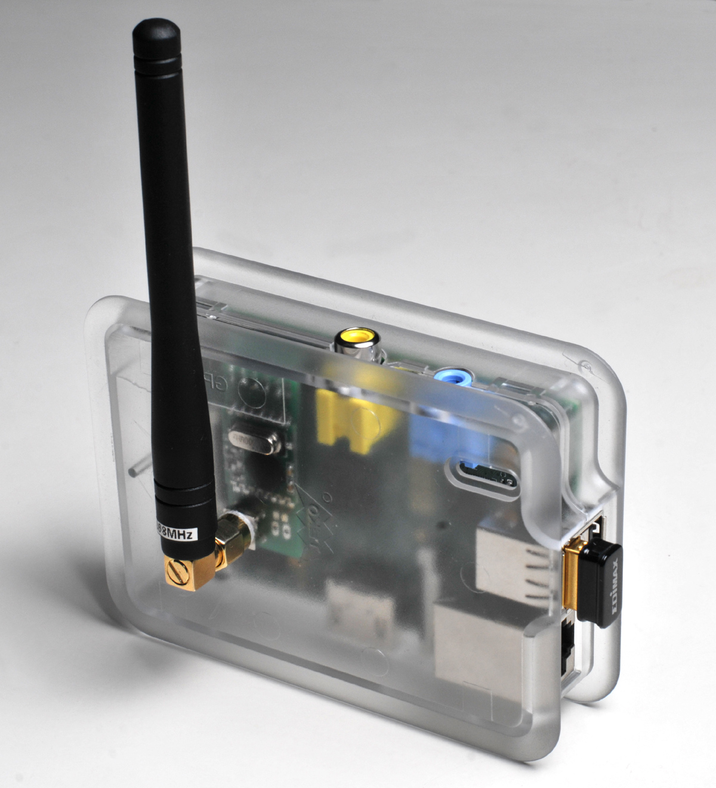

.. rubric:: Config

Example configuration for a RaspyRFM single 868 MHz
.. code-block:: json
   :linenos:
   
  {
    "hardware": {
      "raspyrfm": {
        "spi-channel": 0,
        "frequency": 868350
      }
    }
  }
  
Example configuration for a RaspyRFM single 433 MHz
.. code-block:: json
   :linenos:
   
  {
    "hardware": {
      "raspyrfm": {
        "spi-channel": 0,
        "frequency": 433920
      }
    }
  }

.. note:: **RaspyRFM**

   The RaspyRFM is a radiomodule using the RFM69 from HopeRF.
   https://www.seegel-systeme.de/produkt/raspyrfm-ii/
